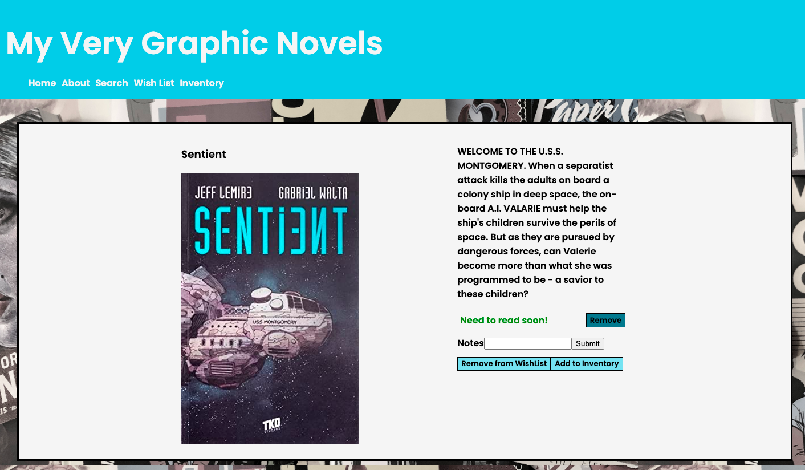
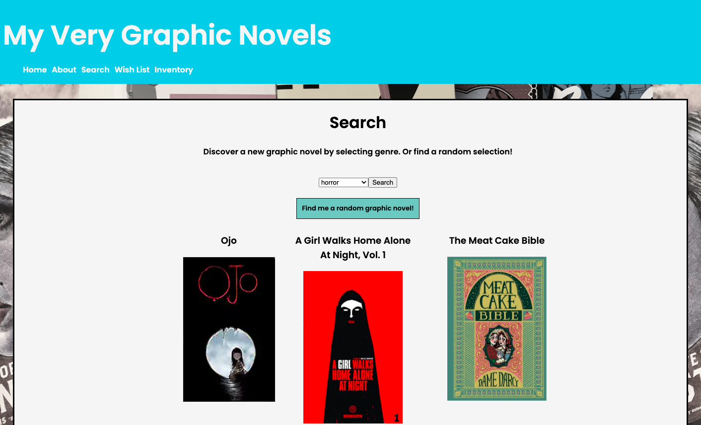

# My Very Graphic Novels

## 12/23/2021

## By: Michael Newman

### [GitHub](https://github.com/therealmikenew) | [LinkedIn](https://www.linkedin.com/in/therealmichaelnewman/) | [Personal Website](https://www.therealmichaelnewman.com/)

---

### **_Description_**

#### My Very Graphic Novels is an application where users can discover new graphic novels and comic books.

#### Users with accounts can search a curated and robust database of mainstream, independent, and international graphic novels and comic books. Also, users can create wish lists for graphic novels and comic books they want read and keep an inventory of what they own or have read.

---

### **_Technologies Used_**

- MongoDB
- Express.js
- React.js
- Node.js

---

### **_Getting Started_**

Deployed to Heroku [https://myverygraphicnovels.herokuapp.com/](https://myverygraphicnovels.herokuapp.com/)

- `Fork` and `clone` this repository
- `cd` into the project directory on your local machine

In the project directory, run:

### `npm run dev`

- Runs the local server to access:

  - [http://localhost:3001/api/books](http://localhost:3001/api/books)
  - [http://localhost:3001/api/comments](http://localhost:3001/api/comments)

Then, `cd` into `mygn-app` and run:

### `npm start`

- Runs the app in the development mode.\
- Open [http://localhost:3000](http://localhost:3000) to view it in your browser.

- The page will reload when you make changes.\
- You may also see any lint errors in the console.

#### A Trello board was used to keep track of development progress and can be viewed [here](https://trello.com/b/XbMC6STN/my-very-graphic-novels).

---

### **_Future tasks_**

- Create functionality so users can enter search terms, ie, enter title, author, etc
- Enable OAuth

---

### **_Credits_**

Information on the graphic novels and comics comes from [Goodreads](https://www.goodreads.com/). Any errors are mine. For requests to change information, contact me via my [LinkedIn](https://www.linkedin.com/in/therealmichaelnewman/).
